# Current OAuth Architecture Implementation

## Architecture Overview

The current OAuth implementation follows a standard OAuth 2.0 authorization code flow with PKCE, integrated into a Cloudflare Workers MCP server.

## System Components

```mermaid
graph TB
    %% External Systems
    User[👤 User/MCP Client]
    Google[🔍 Google OAuth2]
    CF[☁️ Cloudflare Workers]
    KV[🗄️ Cloudflare KV Storage]
    
    %% MCP Server Components
    subgraph "MCP Server (Cloudflare Workers)"
        Router[🌐 Request Router]
        Auth[🔐 OAuth Handlers]
        MCP[📡 MCP Agent]
        Tools[🛠️ Google Drive Tools]
    end
    
    %% OAuth Components
    subgraph "OAuth Flow Components"
        AuthHandler[GoogleOAuthHandler]
        TokenMgr[TokenManager]
        GoogleClient[GoogleApiClient]
        DriveAPI[GoogleDriveAPI]
    end
    
    %% Storage
    subgraph "Storage Layer"
        TokenStorage[Token Storage<br/>google_tokens:userId]
        StateStorage[Auth State Storage<br/>oauth_state:state]
    end
    
    %% User Flow
    User -->|1. Connect via SSE| Router
    Router -->|2. Check Auth| MCP
    MCP -->|3. Auth Required| Auth
    Auth -->|4. Generate Auth URL| AuthHandler
    AuthHandler -->|5. Store State| StateStorage
    AuthHandler -->|6. Redirect to Google| Google
    
    %% OAuth Callback
    Google -->|7. Authorization Code| Auth
    Auth -->|8. Exchange Code| AuthHandler
    AuthHandler -->|9. Get Tokens| Google
    AuthHandler -->|10. Store Tokens| TokenMgr
    TokenMgr -->|11. Encrypt & Store| TokenStorage
    
    %% Tool Execution
    User -->|12. Use Tools| MCP
    MCP -->|13. Check Auth| TokenMgr
    TokenMgr -->|14. Get Valid Tokens| TokenStorage
    TokenMgr -->|15. Refresh if Needed| AuthHandler
    MCP -->|16. Execute Tool| Tools
    Tools -->|17. API Call| GoogleClient
    GoogleClient -->|18. Authenticated Request| Google
    
    %% Storage Connections
    KV --> TokenStorage
    KV --> StateStorage
    TokenMgr --> KV
    AuthHandler --> KV
```



## OAuth Flow Sequence


## Component Details

### 1. OAuth Handlers (`src/auth/`)

**GoogleOAuthHandler** (`google-oauth.ts`):
- Generates authorization URLs with proper scopes
- Exchanges authorization codes for tokens
- Handles token refresh
- Manages user profile retrieval
- Provides CSRF protection via state parameter

**TokenManager** (`token-manager.ts`):
- Encrypts/decrypts tokens for secure storage
- Manages token lifecycle (storage, retrieval, refresh)
- Handles OAuth state management
- Provides automatic token refresh with 5-minute buffer

### 2. API Clients (`src/lib/`)

**GoogleApiClient** (`google-client.ts`):
- Makes authenticated requests to Google APIs
- Handles token injection in Authorization headers
- Provides connection testing functionality

**GoogleDriveAPI** (`google-drive-api.ts`):
- Implements 6 Google Drive tools:
  - `gdrive_search_and_read`
  - `gdrive_create_content`
  - `gdrive_update_content`
  - `gdrive_manage_folders`
  - `gdrive_share_permissions`
  - `gdrive_export_convert`

### 3. MCP Integration (`src/index.ts`)

**MyMCP Class**:
- Extends McpAgent with OAuth authentication
- Initializes auth components on startup
- Provides authentication status tool
- Wraps all Google Drive tools with auth checks

**Request Router**:
- Handles OAuth endpoints (`/authorize`, `/oauth/callback`)
- Routes MCP traffic (`/sse`, `/mcp`)
- Provides health check endpoint

### 4. Storage Schema

**Token Storage** (`google_tokens:userId`):
```typescript
{
  access_token: string;
  refresh_token: string;
  expires_at: number;
  scope: string;
  token_type: string;
}
```

**Auth State Storage** (`oauth_state:state`):
```typescript
{
  state: string;
  redirect_uri: string;
  created_at: number;
}
```

## Security Features

1. **CSRF Protection**: State parameter validation
2. **Token Encryption**: Base64 encoding (production should use proper encryption)
3. **Token Expiration**: 30-day TTL with automatic refresh
4. **State Expiration**: 10-minute TTL for OAuth flow
5. **HTTPS Enforcement**: All OAuth endpoints require HTTPS
6. **Scope Limitation**: Only requests necessary Google Drive scopes

## OAuth Scopes Used

```javascript
const GOOGLE_SCOPES = [
  "openid",           // OpenID Connect
  "email",            // User email
  "profile",          // Basic profile info
  // Note: Current implementation uses basic scopes
  // Google Drive scopes would be added for full functionality
];
```

## Endpoints

- `GET /authorize` - Initiates OAuth flow
- `GET /oauth/callback` - Handles OAuth callback
- `GET /sse` - MCP Server-Sent Events endpoint
- `POST /mcp` - MCP protocol endpoint
- `GET /health` - Health check endpoint

## Current Limitations

1. **Basic Scopes**: Currently uses minimal OAuth scopes (openid, email, profile)
2. **Simple Encryption**: Uses base64 encoding instead of proper encryption
3. **User ID Extraction**: Simplified user ID extraction from context
4. **No Drive Scopes**: Google Drive tools would need additional scopes to function fully

## Future Enhancements

1. Add proper Google Drive OAuth scopes
2. Implement proper token encryption
3. Add multi-provider OAuth support
4. Implement advanced session management
5. Add audit logging and monitoring
